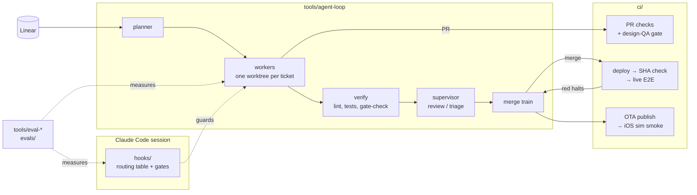

# agent-ops-showcase

The operating layer I built to let Claude Code agents ship production work for a small startup team: an unattended ticket loop, hook-enforced routing gates, an eval harness for the agents themselves, and the CI pipelines that keep agent-written changes honest.

Built July–October 2026 against a real Expo (iOS + web) app and an AWS SAM backend, then generalized and scrubbed for publication. Company names, cloud identifiers, tickets, and product detail have been removed; repo names are placeholders (`your-org/app`, `your-org/backend`).

## The idea

Agents are cheap to run and expensive to trust. Every piece here exists because something went green while the real thing was broken, so the design rule throughout is **verify the running system, not the tool output**:

- an agent's "done" is a `GATES.md` file of runnable checks, re-run by the harness, not a self-report;
- a merge needs a review verdict recorded on the PR, enforced by a hook;
- a deploy is verified by polling the live build's stamped commit SHA before E2E tests drive it;
- the agents' skills are themselves evaluated, with and without the skill installed, and the LLM judge is audited against human labels.

## How it fits together

## What's in here

| Path | What it does |
|---|---|
| `hooks/` | Claude Code plugin hooks. Injects a routing table on every prompt so work goes to the skill that owns it, records which skills a session loaded, and **blocks** tool calls that skip the owner: backend edits without the backend-lead skill, Figma canvas writes without a design skill, ticket creation without a ticket skill, and `gh pr merge` without a `[code-review]` verdict comment on the PR (fail-closed if it can't check). |
| `tools/routing-audit.py` | Read-only weekly audit over local session transcripts: per-domain routing coverage, skills that are never invoked (a loading bug or a dead skill), and plugin version drift. |
| `tools/agent-loop/` | Unattended overnight ticket loop. A planner builds a file-disjoint queue from the backlog; each ticket gets a fresh `claude -p` worker in its own git worktree (parallel, with git operations serialized per repo); the runner re-runs the repo's verify list plus the worker's `GATES.md`; a stateless supervisor reviews each PR against its acceptance criteria and triages failures (retry / skip / halt); a sequential merge train waits for the deploy and runs E2E against what actually shipped. Hard budgets, stop conditions, an escalation token, and a morning `REPORT.md`. |
| `tools/eval-*.mjs`, `evals/` | Eval harness for the agents. Replays implement and review tasks in throwaway worktrees with the skill under test installed and every other plugin disabled; grades mechanically first (`GATES.md` + hidden tests copied in after the agent exits), then with an LLM judge; runs each skill eval with and without the skill as a baseline; and builds a judge-agreement bundle for human labeling. `evals/tasks/` has two illustrative cases. |
| `tools/gate-check.mjs` | The `GATES.md` checker everything above relies on (vendored from [unlazy](https://github.com/Leonxlnx/unlazy), MIT). |
| `ci/frontend/` | Expo app pipelines: PR checks including web-platform typecheck/tests and an iOS Metro export; a design-QA gate that blocks merge without a recorded verdict; RC web deploy then a stamped-SHA check then live Playwright E2E (email OTP retrieved from an inbound mail bucket via a scoped OIDC role); OTA publish chained to an iOS simulator smoke with Maestro and a model-judged screenshot verdict. |
| `ci/backend/` | SAM backend pipelines: tests plus a Python Lambda import smoke against the *built* artifact (the class of bug that passes tests and fails every cold start), `sam validate --lint`, a manual break-glass deploy that verifies a CORS preflight on a live route, and an OpenAPI drift check between the backend spec and the frontend's contract spec. |

## Running it

- **Eval harness tests** run as-is: `node --test "tools/__tests__/*.test.mjs"` (Node 20+, git on PATH). They use a stub in place of `claude`, so they spend nothing.
- **The loop** runs against your own repos: point `tools/agent-loop/loop.config.json` at local clones, then `node tools/agent-loop/agent-loop.mjs --preflight-only` and `--dry-run` before a real run. Workers need `claude` and an authenticated `gh`.
- **Hooks** are written for a Claude Code plugin (`${CLAUDE_PLUGIN_ROOT}/hooks/...`); the skills they route to are not included.
- **CI workflows** are reference copies, not active workflows. They call app-side scripts (`deploy:web:*`, `scripts/qa/*`, `otp-shim.ts`) that aren't part of this repo, and cloud identifiers are `vars.*` / `secrets.*` placeholders.

## Licenses

MIT for original code (`LICENSE`). Vendored: `gate-check.mjs` from unlazy (MIT, `licenses/unlazy-MIT.txt`) and `tools/eval-grader.md` from Anthropic's skill-creator plugin (Apache 2.0, `licenses/skill-creator-Apache-2.0.txt`), both unmodified apart from attribution headers.
